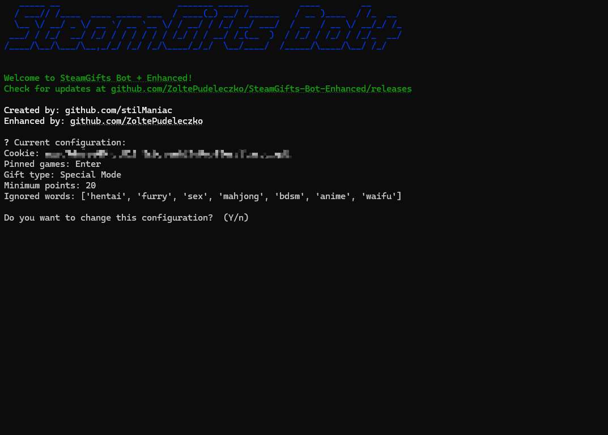

# SteamGifts Bot + Enhanced

The bot specially designed for [SteamGifts.com](https://www.steamgifts.com/) giveaway platform. It automatically enters giveaways for you. Undetectable, does not overstrain SteamGifts API and can run 24/7.

[](https://github.com/ZoltePudeleczko/SteamGifts-Bot-Enhanced/releases)
[](https://github.com/ZoltePudeleczko/SteamGifts-Bot-Enhanced/actions/workflows/build-executables.yml)



## Features

- Automatically enters giveaways
- Can run 24/7
- Sleeps to restock the points
- Remembers configuration and cookie for future runs
- Undetectable

### 🆕 Special Mode 🆕

A mode designed for continuous operation. Just select it, and it will loop through the following actions:

- Enter free giveaways
- Enter wishlist giveaways
- Enter recommended giveaways
- Enter group giveaways
- Enter other giveaways, starting with the highest-rated ones

### Easily configurable

- Choose type of giveaways to enter
  - `wishlist`, `group`, `recommended` etc.
- Only enter giveaways until a certain point threshold
- Enter or ignore pinned giveaways
- Provide a list of keywords to ignore

### Multiplatform

Fully supports macOS, Linux and Windows.

## How to run?

1. Download the latest version from [`releases` (https://github.com/ZoltePudeleczko/SteamGifts-Bot-Enhanced/releases)](https://github.com/ZoltePudeleczko/SteamGifts-Bot-Enhanced/releases)
2. Sign in on [SteamGifts.com](https://www.steamgifts.com/)
3. Find `PHPSESSID` cookie in your browser
4. Start the bot and follow instructions

### Run from source

Make sure you have [Python 3.9](https://www.python.org/downloads/) installed.

Clone the repository, install dependencies and run the bot:

```bash
pip install -r requirements.txt
python src/cli.py
```

## What's next?

Please leave your feedback and report bugs on the [`Issues page`](https://github.com/ZoltePudeleczko/SteamGifts-Bot-Enhanced/issues).

## Original version

The original version, developed by [stilManiac](https://github.com/stilManiac), can be found [here](https://github.com/stilManiac/steamgifts-bot). Thanks for the great work!
